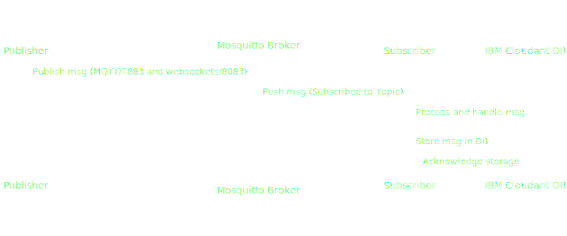

# Overview

## Course content

This course will enable you to:

- Build your own mosquitto container image
- Deploy the mosquitto broker on IBM Code Engine
- Develop a publisher app in Python
- Develop and deploy your subscriber app in Python
- Persist messages via the subscriber app in an IBM Cloudant database

## Sequence Diagram

<!-- 

<picture class="light-theme">
  
</picture>

<picture class="dark-theme">
  
</picture> -->

<picture>
  
</picture>

<!-- <picture>
    <source srcset="./files/sequence-diagram_light.svg" media="(prefers-color-scheme: dark)">
    <source srcset="./files/sequence-diagram_dark.svg" media="(prefers-color-scheme: light)">
    
</picture> -->
