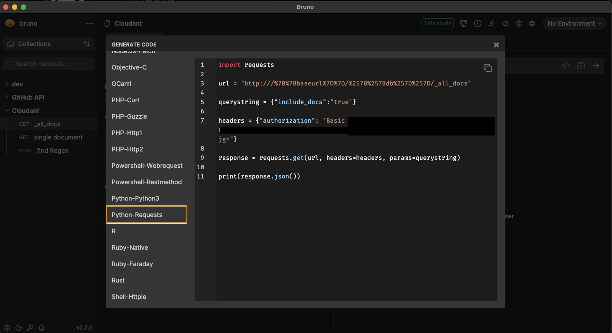

# OPTIONAL: API Test Client


[Bruno](https://www.usebruno.com/) is a lightweight, open-source API client designed for developers who prefer storing their collections in version control. In this course, we'll use Bruno to **test our connections and queries to IBM Cloudant**, helping us validate our APIs and inspect responses quickly before implementing the queries in Python.

> If you haven’t installed Bruno yet, refer to the [installation guide](./1_pre-requisites.md#4-bruno-api-test-client).

## Why Bruno?

- Local-first, Git-friendly API collections.
- Open-source and privacy-focused.
- Fast, responsive, and simple to use.
- Ideal for REST API testing.

## Getting Started with Bruno

### 1. Creating a GET Request

1. Open Bruno and create a new workspace.
2. Create a new collection (e.g., `Cloudant`).
3. Add a new request:
   - Method: `GET`
   - URL: `https://<your-cloudant-hostname>.cloudantnosqldb.appdomain.cloud/<your-database-name>`
4. Click **Send** and inspect the response in the lower panel.

### 2. Setting Collection Variables

To avoid hardcoding values like hostnames or API keys, set them as variables in your collection.

#### Finding Your Cloudant Service Credentials

Follow these steps to retrieve the **read-only** service credentials from IBM Cloud:

1. Log in to [IBM Cloud](https://cloud.ibm.com/).
2. In the Resource list under `Databases` navigate to your **Cloudant** service instance.
3. In the left-hand sidebar, click **Service credentials**.
4. Locate the **read-only** credential set (it may be labeled or described accordingly).
5. Click **View credentials**.
6. Copy the following fields:
   - `host`
   - `username`
   - `password`

#### Adding Variables in Bruno

1. Open your collection in Bruno.
2. Go to the **Variables** tab.
3. Add the following variables (replace the values with the ones you copied from IBM Cloud):

   ```json
   {
     "baseUrl": "https://<cloudant-host>",
     "db": "your-database-name"
   }
   ```

   These variables can now be used throughout your requests to securely and consistently reference your Cloudant setup.

### 3. Using Variables in Requests

In your request URL or headers, use double curly braces:

```
{{baseUrl}}/{{db}}
```

Bruno will automatically substitute the values when sending the request.

### 4. Setting Authentication on the Collection

To apply authentication across all requests in a collection:

1. Open the collection.
2. Navigate to the **Auth** tab.
3. Select **Basic Auth**
   - Username: your service credentials username
   - Password: your service credentials password
4. Save changes.

### 5. Inheriting Auth in Requests

When you set auth at the collection level, individual requests will automatically **inherit** those settings unless you override them. This keeps your requests clean and consistent.

## Example request

**Request Method:** `GET`  
**Request URL:**

```
{{baseUrl}}/{{db}}/_all_docs?include_docs=true
```

This request will fetch all documents from your Cloudant database using inherited authentication and variable substitution. The response should look like the one below

```json
{
  "total_rows": 1,
  "offset": 0,
  "rows": [
    {
      "id": "ed641153551107eaf2c3d5925223b70c",
      "key": "ed641153551107eaf2c3d5925223b70c",
      "value": {
        "rev": "1-176d5fe794b457ddfb51db2fdc621f78"
      },
      "doc": {
        "_id": "ed641153551107eaf2c3d5925223b70c",
        "_rev": "1-176d5fe794b457ddfb51db2fdc621f78",
        "message": "{\"id\": 1, \"message\": \"Hello from student1!\"}"
      }
    }
  ]
}
```

### 6. Code generation

Once you successfully managed to use an API, you can use Bruno to generate code samples in various languages / libraries <br />

