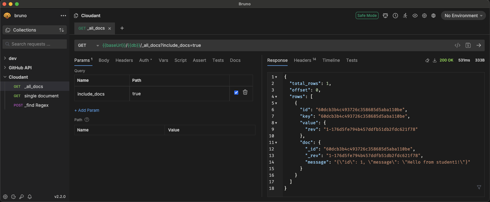
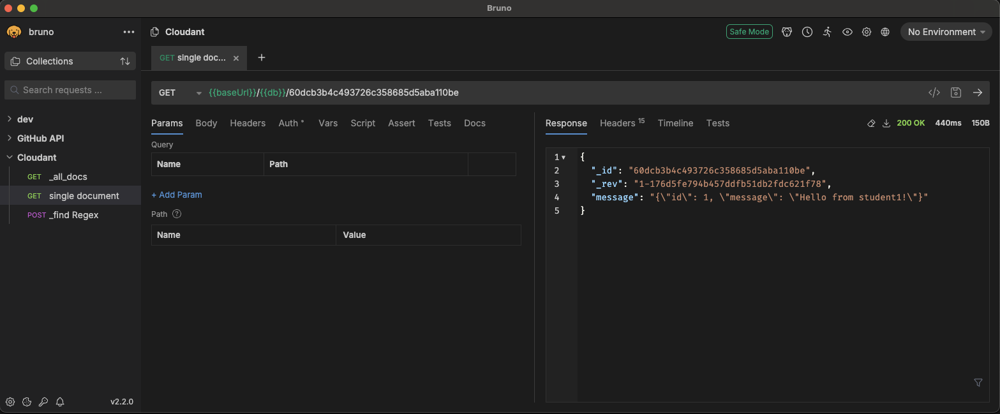
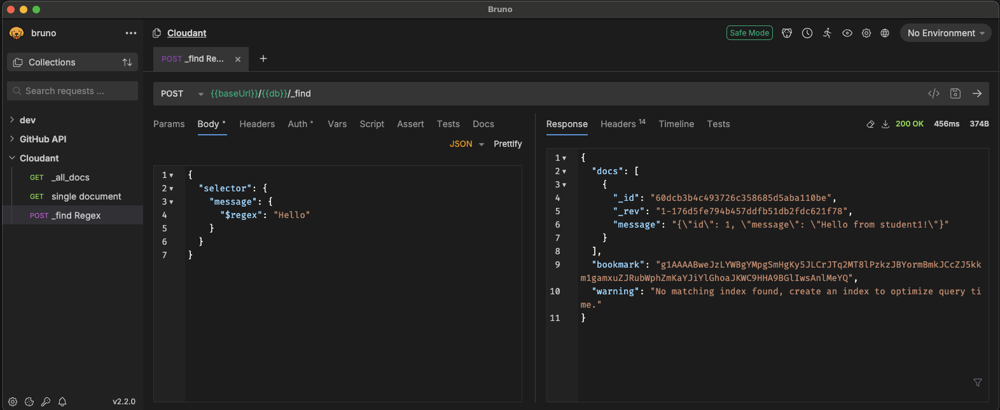
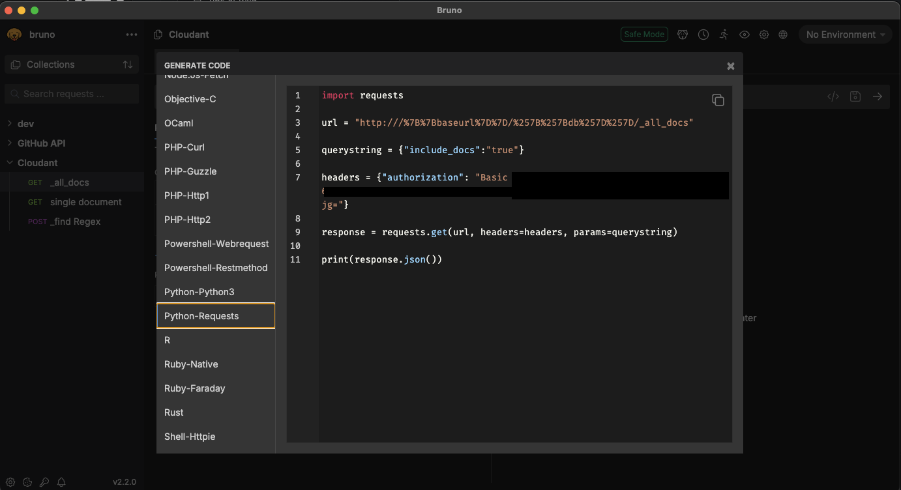

# Cloudant Database

## Introduction

IBM Cloudant is a NoSQL JSON document database based on CouchDB. It's a scalable and flexible database that allows you to store and manage large amounts of data in a JSON format.

## Interacting with Cloudant

Cloudant provides a RESTful API that allows you to interact with the database using HTTP requests. You can use the API to create, read, update, and delete documents in the database.

## Testing the APIs

Before implementing the APIs in Python, you can use a tool like Bruno to test the APIs. Bruno is a simple and intuitive API test client that allows you to send HTTP requests and inspect the responses. For more details check out [this chapter](./6_API-client.md)

## Service Credentials

Two sets of service credentials were created beforehand. The credentials can be found in the IBM Cloud's [resource overview](https://cloud.ibm.com/resources) under the databases section.

#### Read-only credentials

These credentials can be used to read data from the database.

#### Write credentials

These credentials can be used to write data to the database.

## API Endpoints

The following API endpoints will be used:

- All Docs: GET /{database_name}/\_all_docs
- Single Document Retrieval: GET /{database_name}/{document_id}
- \_find with Regex: POST /{database_name}/\_find with a JSON body containing the regex query.

### Example all docs

### Example single document

### Example find

## Python Implementation

After testing the APIs using Bruno, you can implement them in Python using the requests library. You will need to use the requests library to send HTTP requests to the Cloudant API endpoints.

Bruno can generate code in various programming languages and libraries for you. Once the API works, let Bruno generate the code for you! 

## Tips and Variations

- Use the json library to parse the JSON responses from the Cloudant API.
- Use the requests library to send HTTP requests to the Cloudant API endpoints.
- Use the auth parameter to pass the service credentials in the HTTP requests.
- Use a try-except block to handle errors when sending HTTP requests to the Cloudant API.
